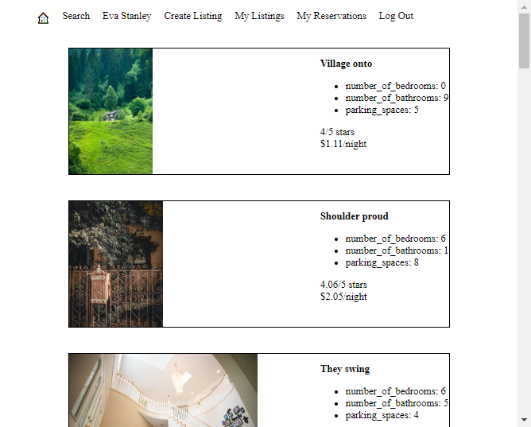
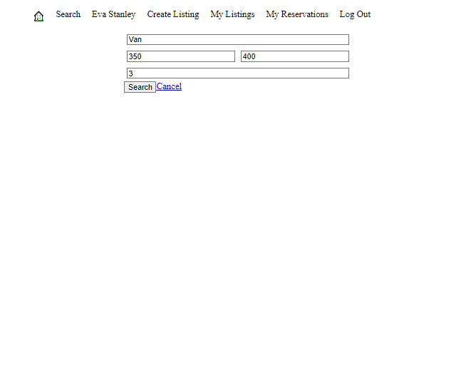
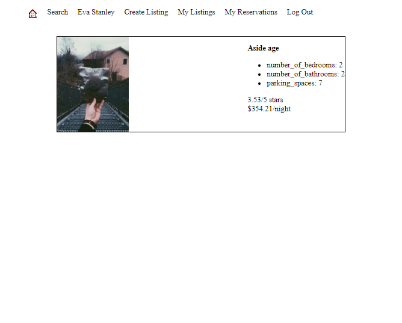
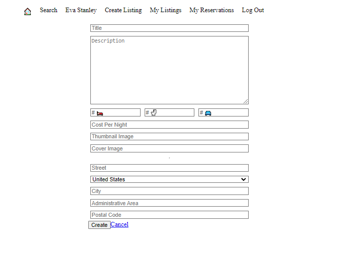

# LightBnB

A simple multi-page Airbnb clone that uses a server-side Javascript to display the information from queries to web pages via SQL queries.

## Getting Started
1. Clone this repo: `git clone git@github.com:Desyn6/LightBnB.git`.
2. This app uses PostgreSQL - please refer to [PostgreSQL Setup](###PostgreSQL-Setup).
3. Open the application directory: `cd /LightBnB_WebApp`.
4. Ensure that you are using node version 16 or later: `node -v`.
5. Install the dependencies: `npm install`.
6. Copy the .env file `cp .env.example .env`
7. If you are using your own PostgreSQL credentials, update the `DB_USER` and `DB_PASS` fields in .env accordingly.
8. Run the application: `npm run local`.
9. Access the application in your browser at `localhost:[PORT]`. The default port is `3000`.  

### PostgreSQL Setup
1. You will require PostgreSQL to use this application; please ensure that it is installed. If not, you can download PostgreSQL [here](https://www.postgresql.org/about/).
2. Start PostgreSQL: `psql` - please note that if you are on WSL, you will need to use the following command first: `startposgresql`.
3. Run the following commands to create the necessary objects: 
`CREATE ROLE labber WITH LOGIN password 'labber';
CREATE DATABASE lightbnb OWNER labber;`.
4. Connect to the database: `\c lightbnb`.
5. Run the schema in migrations `\i /migrations/01_schema.sql`.
6. Seed the schema with dummy daya `\i /seeds/01_seeds.sql`, `\i /seeds/02_seeds.sql`.
7. Exit out of the PSQL `\q`.

## Features

1. Search for properties! You can filter by city, minimum/maximum cost, and minimum rating. These options are accessed via the Search tab in the top navigation bar.
2. Create a listing (see top navigation bar).
3. View your listings (see top navigation bar).
4. View your reservations (see top naviation bar).

## Environment
- Node v16 or higher

## Dependencies
- bcrypt 3.0.6 or above
- cookie-session 1.3.3 or above
- dotenv 16.0.3 or above
- express 4.17.1 or above
- nodemon 1.19.1 or above
- pg 8.10.0 or above

## Interface Images
The following screenshots show various parts of the app interface. While the design is basic (for now!) we are confident that you will be able to customize our template into your dream home-rental website!

Landing Page



Search Page



Search Results



Add New Property Interface



## Project Structure

```
.
├── db
│   ├── json
│   └── database.js
├── public
│   ├── javascript
│   │   ├── components 
│   │   │   ├── header.js
│   │   │   ├── login_form.js
│   │   │   ├── new_property_form.js
│   │   │   ├── property_listing.js
│   │   │   ├── property_listings.js
│   │   │   ├── search_form.js
│   │   │   └── signup_form.js
│   │   ├── libraries
│   │   ├── index.js
│   │   ├── network.js
│   │   └── views_manager.js
│   ├── styles
│   │   ├── main.css
│   │   └── main.css.map
│   └── index.html
├── routes
│   ├── apiRoutes.js
│   └── userRoutes.js
├── styles  
│   ├── _forms.scss
│   ├── _header.scss
│   ├── _property-listings.scss
│   └── main.scss
├── .gitignore
├── package-lock.json
├── package.json
├── README.md
└── server.js
```

* `db` contains all the database interaction code.
  * `json` is a directory that contains a bunch of dummy data in `.json` files.
  * `database.js` is responsible for all queries to the database. It doesn't currently connect to any database, all it does is return data from `.json` files.
* `public` contains all of the HTML, CSS, and client side JavaScript. 
  * `index.html` is the entry point to the application. It's the only html page because this is a single page application.
  * `javascript` contains all of the client side javascript files.
    * `index.js` starts up the application by rendering the listings.
    * `network.js` manages all ajax requests to the server.
    * `views_manager.js` manages which components appear on screen.
    * `components` contains all of the individual html components. They are all created using jQuery.
* `routes` contains the router files which are responsible for any HTTP requests to `/users/something` or `/api/something`. 
* `styles` contains all of the sass files. 
* `server.js` is the entry point to the application. This connects the routes to the database.
